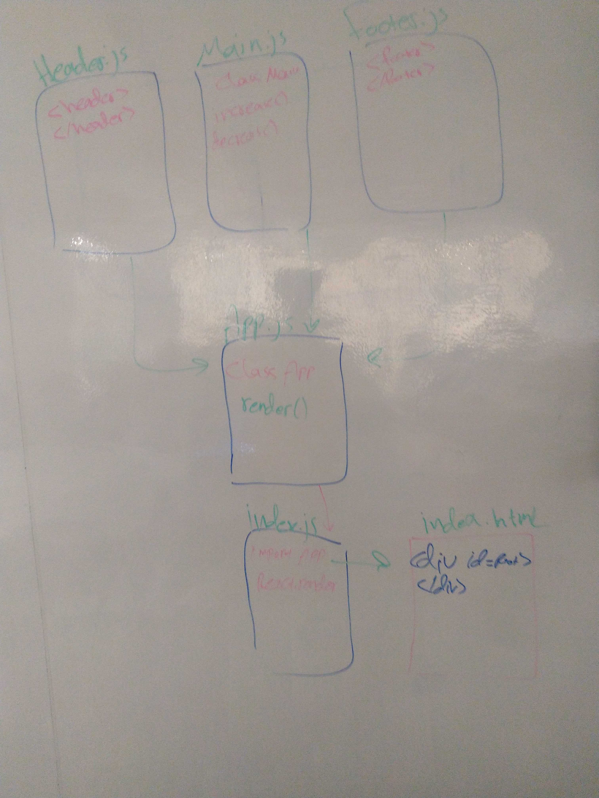

# LAB - Class 27

## React Testing and Deployment

### Author: Ibrahim/Naseem

### Links and Resources
* [submission PR]()
* [ci/cd]() (GitHub Actions)
* [front-end application](https://401-advanced-javascript-ibrahim.github.io/lab27/) (when applicable)
### Setup
#### How to initialize/run your application (where applicable)
* `npm run start` 
#### Tests
* How do you run tests?
* `npm run test` 
#### UML
